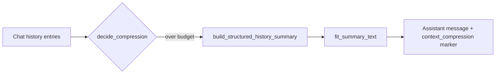

## Tool `context_compression`

`Tools/context_compression/` — Compress long chat histories into a structured **memory base** (JSON inside `[Conversation History Summary Base]` markers) so later turns stay within the model context window.

Used in production by [`Apps.UI/views`](../../Apps/UI/views/) (`context_compress_api`, streaming compression during generation).

---

## Module map

| Doc | Source | Role |
| --- | --- | --- |
| [history_compressor](history_compressor/) | `history_compressor.py` | Decision logic, sanitization, summary builders |
| [tests](tests/) | `tests/` | Pytest regression suite |

`__init__.py` is an empty package marker.

**Not documented here:** `.pytest_cache/`, `pytest.ini`, local `db.sqlite3` / `test/` output artifacts.

---

## Data flow (runtime)

---

## Related

- [update_model_runtime_metadata](../update_model_runtime_metadata/)
