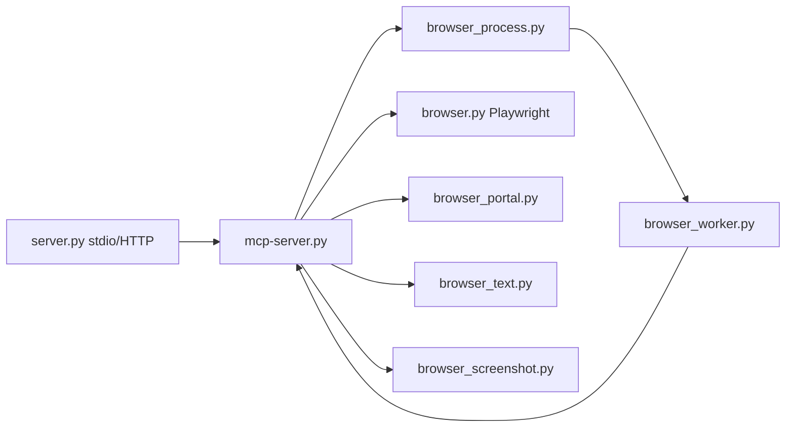

## Tool `mcp-browser-agent`

`Tools/mcp-browser-agent/` — MCP tool server for **Playwright/Camoufox** browser automation: navigate, snapshot controls, click, type, scroll, screenshots, and interactive **browser portal** handoff for human-in-the-loop steps.

Registered in ASLM Chat as tool server id `browser_agent`. The chat UI embeds live portal frames via [`Apps.UI/static/js/ui/browser-portal-ui`](../../Apps/UI/static/js/ui/browser-portal-ui/) and Django APIs under [`Apps.UI/views`](../../Apps/UI/views/).

---

## Architecture

| Mode | How tools run |
| --- | --- |
| Default | Parent process spawns `browser_worker.py`; JSON-line IPC |
| `ASLM_BROWSER_AGENT_INLINE=1` or worker env | Tools run in-process on dedicated browser thread |
| `ASLM_BROWSER_AGENT_WORKER=1` | Worker subprocess executes tools directly |

---

## Module map

| Doc | Source | Role |
| --- | --- | --- |
| [config](config/) | `config.py` | Paths, viewport, a11y limits |
| [browser](browser/) | `browser.py` | Camoufox session, a11y tree, snapshots, clicks |
| [browser_process](browser_process/) | `browser_process.py` | Worker subprocess lifecycle |
| [browser_worker](browser_worker/) | `browser_worker.py` | Stdin/stdout JSON worker loop |
| [mcp-server](mcp-server/) | `mcp-server.py` | Tool definitions and execution bridge |
| [server](server/) | `server.py` | MCP Server entry (stdio or HTTP) |
| [browser_portal](browser_portal/) | `browser_portal.py` | Live portal state/events |
| [browser_text](browser_text/) | `browser_text.py` | Editor read/set/replace/delete |
| [browser_screenshot](browser_screenshot/) | `browser_screenshot.py` | PNG capture + vision gating |
| [tests](tests/) | `tests/` | Pytest suite |

---

## Related

- [Tools](../_index/)
- [model_runtime_metadata](../update_model_runtime_metadata/) — vision capability for screenshots
