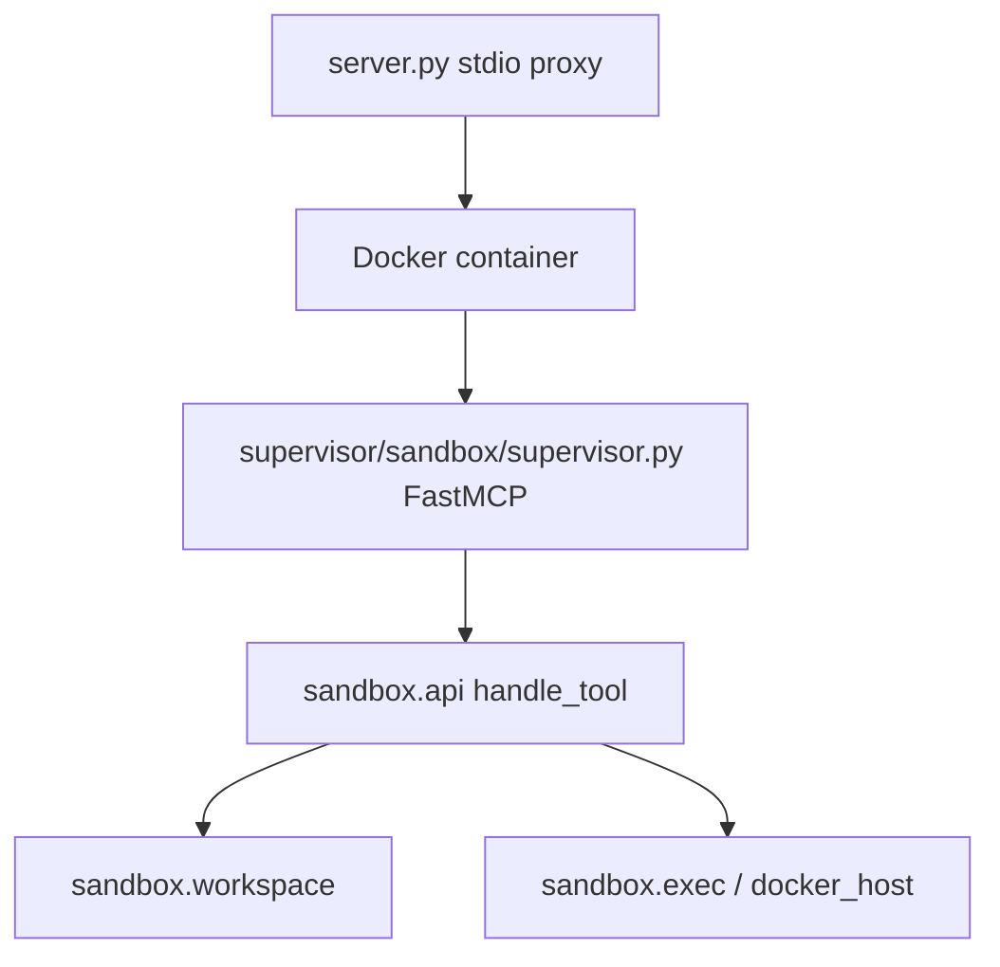

## Tool `mcp-sandbox`

`Tools/mcp-sandbox/` — Docker-backed **Linux sandbox** MCP server for ASLM Chat: `bash`, `write`, `edit`, `view_image`, and `share_file` inside an isolated workspace (`_sandbox/`).

| Entry | Role |
| --- | --- |
| [server](server/) | Host stdio proxy → container supervisor |
| [mcp-server](mcp-server/) | ASLM `call_tool` bridge; patches host bash to Docker |
| [setup-sandbox](setup-sandbox/) | Pull/build Docker image before first use |
| [docker_host](docker_host/) | Container lifecycle, supervisor pipe, `docker exec` bash |

Python package **`sandbox`** lives under `supervisor/sandbox/` (on `sys.path` via `supervisor/` and `src/`).

---

## Runtime layout

| Where | `IN_CONTAINER` | Bash execution |
| --- | --- | --- |
| Inside container | `1` | [exec](supervisor/sandbox/exec/) native |
| Host via [mcp-server](mcp-server/) | `0` | [docker_host](docker_host/) `docker exec` |

Configuration: `sandbox.env` (loaded by [config](supervisor/sandbox/config/)).

Workspace on host: `{HOST_WORKSPACE}/_sandbox` (default under `Tools/mcp-sandbox/`).

---

## Supervisor package

| Doc | Source | Role |
| --- | --- | --- |
| [supervisor](supervisor/) | `supervisor/` | Path to in-container tree |
| [supervisor/sandbox](supervisor/sandbox/) | `supervisor/sandbox/` | Package index |
| [api](supervisor/sandbox/api/) | Tool handlers and bash routing |
| [workspace](supervisor/sandbox/workspace/) | Path security and file ops |
| [exec](supervisor/sandbox/exec/) | Native bash and background jobs |
| [jobs](supervisor/sandbox/jobs/) | Background job registry |
| [intent](supervisor/sandbox/intent/) | Shell command classification |
| [controller](supervisor/sandbox/controller/) | Intent → workspace handlers (tested; not wired into `api._try_supervise` yet) |
| [session_state](supervisor/sandbox/session_state/) | Exploration memory for controller |
| [presenters](supervisor/sandbox/presenters/) | Model-friendly previews |
| [cleanup](supervisor/sandbox/cleanup/) | Idle workspace staging/recycle |
| [config](supervisor/sandbox/config/) | Env and limits |
| [responses](supervisor/sandbox/responses/) | v2 result envelope |
| [container](supervisor/sandbox/container/) | Native job list/fg/kill |
| [tools](supervisor/sandbox/tools/) | FastMCP registration |
| [supervisor](supervisor/sandbox/supervisor/) | In-container MCP entry |

---

## Tests and ops

| Path | Role |
| --- | --- |
| [tests](tests/) | Pytest suite |
| `Dockerfile` / `docker/start-container.sh` | Image build and container entry |
| `Makefile` | Local dev shortcuts |

---

## Related

- [Tools](../_index/)
- [mcp-browser-agent](../mcp-browser-agent/) — browser downloads under `_sandbox/downloads`
- [update_model_runtime_metadata](../update_model_runtime_metadata/) — vision gating for `view_image`
