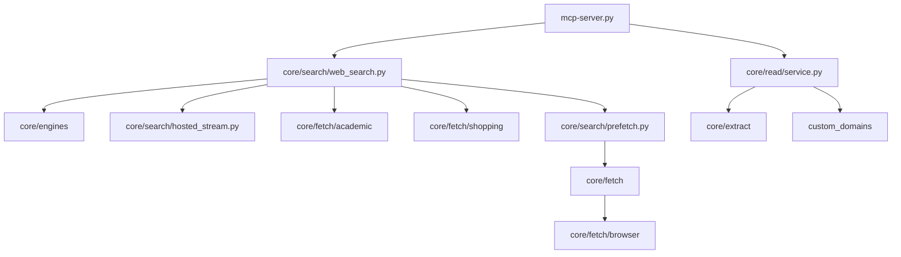

## Tool `mcp-web-search`

`Tools/mcp-web-search/` — MCP tool server for **web search** and **read page**: multi-engine HTTP SERP (yandex / duckduckgo / google / startpage / brave / qwant / yep), hosted API supplement (Tavily / Firecrawl / Brave / SerpApi), academic and shopping verticals, optional onion layer, warm-browser fetch fallback, BM25 preview extraction, and structured UI payloads for ASLM Chat.

Registered as tool server id `web_search`.

---

Follow [Tools documentation conventions](../_index/#documentation-conventions) (heading levels, `tests/` layout, module page template).

---

## Entry points

| Doc | Source | Role |
| --- | --- | --- |
| [mcp-server](mcp-server/) | `mcp-server.py` | ASLM `call_tool` bridge (`web_search`, `read_page`) |

---

## Packages

| Doc | Source | Role |
| --- | --- | --- |
| [core](core/) | `core/` | Config, engines, search, fetch, extract, cache, profiles, read |
| [custom_domains](custom_domains/) | `custom_domains/` | Site-specific fetchers |
| [tests](tests/) | `tests/` | Pytest suite |

---

## Configuration (on disk)

| File | Doc |
| --- | --- |
| `core/config/search_config.json` | [core/config/settings](core/config/settings/) |
| `core/config/api_keys.json` | [core/config/api_keys](core/config/api_keys/) |

---

## Related

- [Tools](../_index/)
- [mcp-browser-agent](../mcp-browser-agent/)
