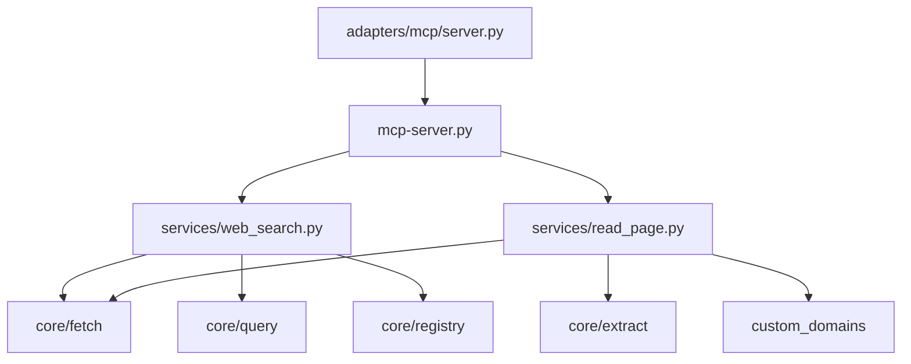

## Tool `mcp-web-search`

`Tools/mcp-web-search/` — MCP tool server for **web search** and **read page**: multi-engine SERP (DDGS, optional hosted APIs), neural query classification, domain/trust registries, preview extraction, and structured UI payloads for ASLM Chat.

Registered as tool server id `web_search`.

---

Follow [Tools documentation conventions](../_index/#documentation-conventions) (heading levels, `tests/` layout, module page template).

---

## Entry points

| Doc | Source | Role |
| --- | --- | --- |
| [mcp-server](mcp-server/) | `mcp-server.py` | ASLM `call_tool` bridge (tool worker) |
| [adapters/mcp/server](adapters/mcp/server/) | `adapters/mcp/server.py` | FastMCP stdio (`web_search`, `read_page`) |
| [setup_env](setup_env/) | `setup_env.py` | Tool venv via ASLM `venv_manager` |
| [setup_mcp](setup_mcp/) | `setup_mcp.py` | MCP server JSON for IDE config |

---

## Packages

| Doc | Source | Role |
| --- | --- | --- |
| [services](services/) | `services/` | `WebSearchService`, `ReadPageService` |
| [core](core/) | `core/` | Config, fetch, extract, cache, registry, models |
| [adapters](adapters/) | `adapters/` | MCP transport |
| [custom_domains](custom_domains/) | `custom_domains/` | Site-specific fetchers |
| [tests](tests/) | `tests/` | Pytest suite |

---

## Configuration (on disk)

| File | Doc |
| --- | --- |
| `core/config/search_config.json` | [core/config/settings](core/config/settings/) |
| `core/config/api_keys.json` | [core/config/api_keys](core/config/api_keys/) |
| `models/` (ASLM ONNX exports) | [core/query/aslm_embedding_models](core/query/aslm_embedding_models/) |

---

## Related

- [Tools](../_index/)
- [mcp-browser-agent](../mcp-browser-agent/)
- ASLM embedding repos (`ASLM-Chat-WS-Embedding-*`)
